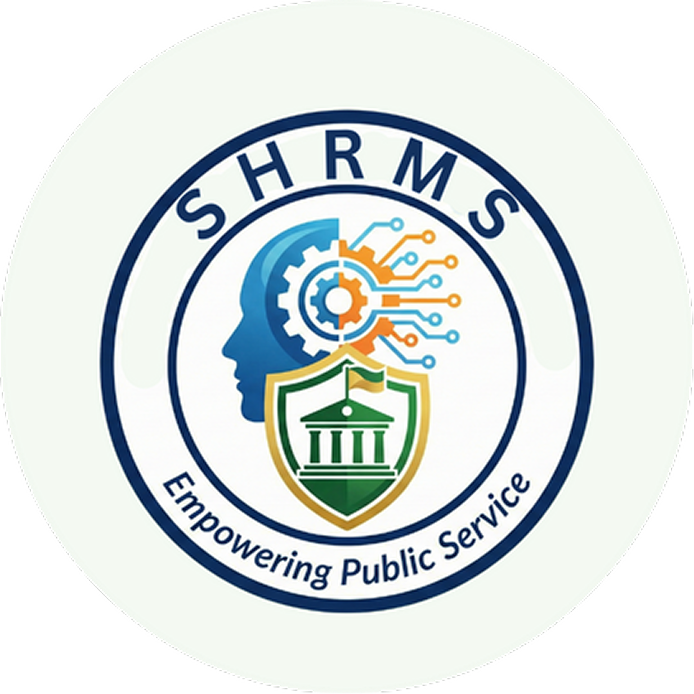

    

<h1 align="center">Smart Human Resource Management System</h1>

    <em>An algorithm-driven HR platform for process automation and decision support.</em>

---

## Introduction

**Smart HRMS** is a Laravel 12 + React 19 (Inertia.js v2) web application designed to modernize human resource operations through automation and data-driven insight. The system consolidates day-to-day HR workflows — leave applications, performance evaluation, attendance tracking, and training planning — into a single, role-aware interface for **employees**, **evaluators**, **HR personnel**, and **PMT officers**.

At its core, Smart HRMS is powered by **four Python-based AI modules** that handle intelligent routing, predictive analytics, real-time scoring, and content-based training recommendation. The result is a streamlined HR experience that reduces manual effort, surfaces actionable metrics, and supports better workforce decisions.

---

## Core Features

### 1. Intelligent Workflow Routing System (IWR)
> *Leave Application and IPCR Routing*

Automates document flow using a **Rule-Based Workflow + Decision Tree** algorithm. Leave applications are routed to the correct approver chain, and IPCR (Individual Performance Commitment and Review) forms are sent to the appropriate evaluator based on department, role, and approval rules — eliminating misrouted requests and manual handoffs.

### 2. Predictive Performance Evaluation (PPE)
> *Forecasting employee performance trends*

Uses a **Linear Regression model** trained on three years of quarterly performance data and rating history to predict an employee's performance trajectory. Helps evaluators and HR identify high-potential staff and surface early-warning signals for declining performance.

### 3. Real-Time HR Analytics Dashboard
> *Live operational metrics powered by FlatFAT*

Displays aggregated HR metrics in real time using the **FlatFAT algorithm**, including live employee attendance streamed from the biometric terminal via the **ZKBio Zlink cloud webhook** (`acc_transaction:push`). HR personnel get an at-a-glance view of workforce status without waiting for end-of-day reports.

### 4. Automated Training Recommendation Engine (ATRE)
> *Closing competency gaps*

Applies **Content-Based Filtering** to map competency gaps from IPCR evaluation results against the seminar/training catalog. Each employee receives tailored training recommendations targeting the specific areas where they scored lowest.

---

## Getting Started (Installer)

Smart HRMS is distributed as a Windows desktop application that connects to the Smart HRMS cloud server.

### Requirements

- **Windows 10 or Windows 11 (64-bit)**
- **An active internet connection** — the desktop app connects to the cloud server and **will not run offline**.

### Step-by-Step Procedure

1. **Run the installer** — double-click **`Smart-HRMS-Setup-1.0.0.exe`**.
2. **Follow the setup wizard** — accept the prompts to install the application.
3. **Launch the application** — open **"Smart HRMS"** from the Start menu or the desktop shortcut.
4. **Wait for the cloud server to wake** — the **first launch may take up to 5 minutes** while the cloud server starts up. A loading screen shows progress. This is normal after a period of inactivity and only happens on a cold start.

> ⚠️ **Windows SmartScreen:** The installer is unsigned, so Windows SmartScreen may display a warning. If it appears, choose **"More info" → "Run anyway"** to continue.

---

## Live System Access

The system is also accessible from any web browser at:

**https://smart-hrms.onrender.com/**

The same cold-start behavior applies: if the server has been idle, the first request may take up to 5 minutes to respond while it wakes.

---

## User Accounts & Credentials

All accounts below share the password **`password`**.

> These are **demo/thesis accounts** provided for evaluation and demonstration purposes.

### Administrator
*No administrator account is seeded in this build.*

### HR Personnel
| Name       | Email                 | Employee ID |
| ---------- | --------------------- | ----------- |
| Grace Tan  | grace.tan@shrms.test  | HR-001      |

### Evaluator
| Name        | Email                  | Employee ID |
| ----------- | ---------------------- | ----------- |
| John Reyes  | john.reyes@shrms.test  | EMP-001     |

### Employee
| Name                  | Email                              | Employee ID |
| --------------------- | ---------------------------------- | ----------- |
| Maria Santos          | maria.santos@shrms.test            | EMP-002     |
| Mark Bautista         | mark.bautista@shrms.test           | EMP-003     |
| Angela Cruz           | angela.cruz@shrms.test             | EMP-004     |
| Patricia Garcia       | patricia.garcia@shrms.test         | EMP-005     |
| Kevin Mendoza         | kevin.mendoza@shrms.test           | EMP-006     |
| Lorraine Flores       | lorraine.flores@shrms.test         | EMP-007     |
| Daniel Ramos          | daniel.ramos@shrms.test            | EMP-008     |
| Camille Navarro       | camille.navarro@shrms.test         | EMP-009     |
| Joshua Aquino         | joshua.aquino@shrms.test           | EMP-010     |
| Ana Dela Cruz         | ana.delacruz@shrms.test            | EMP-011     |
| Ramon Villanueva      | ramon.villanueva@shrms.test        | EMP-012     |
| Josephine Pascual     | josephine.pascual@shrms.test       | EMP-013     |
| Michael Torres        | michael.torres@shrms.test          | EMP-014     |
| Liza Castillo         | liza.castillo@shrms.test           | EMP-015     |
| Roberto Jimenez       | roberto.jimenez@shrms.test         | EMP-016     |
| Christine Morales     | christine.morales@shrms.test       | EMP-017     |
| Ferdinand Aguilar     | ferdinand.aguilar@shrms.test       | EMP-018     |
| Maricel Dela Rosa     | maricel.delarosa@shrms.test        | EMP-019     |
| Benedict Mercado      | benedict.mercado@shrms.test        | EMP-020     |
| Theresa Evangelista   | theresa.evangelista@shrms.test     | EMP-021     |

### PMT Officer
| Name        | Email                  | Employee ID |
| ----------- | ---------------------- | ----------- |
| Mark Reyes  | mark.reyes@shrms.test  | PMT-001     |

### Additional Employee Accounts (Live-Created)

These employee accounts were added through the app's Employee Directory
after the initial setup. Each was assigned its own random temporary
password at creation (shown once to HR) and requires a password change on
first login, so a shared password is not listed for them. For evaluation,
use the demo accounts above instead.

| Name               | Email                             | Employee ID |
| ------------------ | --------------------------------- | ----------- |
| Juan Dela Cruz     | juan.delacruz@shrms.test          | EMP-022     |
| Maria Dela Cruz    | maria.delacruz@shrms.test         | EMP-023     |
| Michelle Dela Cruz | michelle.delacruz@shrms.test      | EMP-025     |
| John Doctor        | john.doctor@shrms.test            | EMP-026     |
| Mark Delos Santos  | mark.delossantos@shrms.test       | EMP-027     |
| Juan David         | juan.david@shrms.test             | EMP-028     |
| Henry Roque        | henry.roque@shrms.test            | EMP-029     |
| Gabe Cervantes     | gabe.cervantes@shrms.test         | EMP-030     |
| Kim Mendoza        | kim.mendoza@shrms.test            | EMP-031     |
| Ronell Bagain      | ronell.bagain@shrms.test          | EMP-032     |
| May Nard           | may.nard@shrms.test               | EMP-033     |
| Lem Dough          | lem.dough@shrms.test              | EMP-034     |
| Jose Santos        | jose.santos@shrms.test            | EMP-035     |
| Martin Santos      | martin.santos@shrms.test          | EMP-037     |

_(EMP-024 and the EMP-036 migration test account are inactive/internal and are omitted.)_

---

## System Limitations

While Smart HRMS covers a broad range of HR workflows, it is intentionally **scoped** and does not address every HR function. Known limitations include:

- **No offline accessibility** — the system requires an active internet connection. There is no offline or sync-on-reconnect mode.
- **No payroll management** — salary computation, pay slip generation, tax withholding, and benefits disbursement are out of scope.
- **No recruitment management** — applicant tracking, job posting, interview scheduling, and onboarding pipelines are not included.
- **Limited mobile experience** — the interface is responsive but not packaged as a native mobile application.
- **Biometric dependency** — real-time attendance metrics depend on a ZKTeco terminal bound to a ZKBio Zlink tenant; events reach the system through the Zlink cloud webhook.
- **English-only UI** — no multi-language localization at this time.

---

## License

This project is intended for academic and institutional use. Refer to the repository owner for licensing terms.
